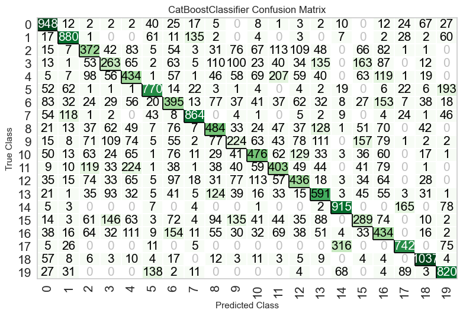
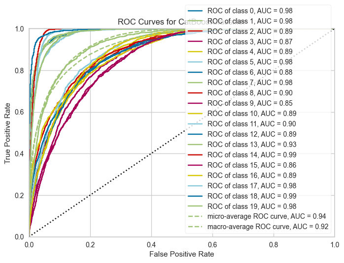

# sEMG Physical Action Classfication
## requirements
python==3.10
pycaret
pandas
numpy
joblib==1.3.0
## Dataset
[sEMG Physical Action Classfication](https://archive.ics.uci.edu/dataset/213/emg+physical+action+data+set)
## Data Explore
USE [pycaret](https://github.com/pycaret/pycaret) to fit ML algo
## Result

